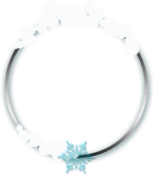

 <section class="leaderboard-section">
        <!-- User and Talent btns -->

        

          <button class="userl active tab tab3"></button>
          <button class="talentl tab tab3"></button>
        

        

          <!-- Leaderboard round-btns -->

          

            <button class="round-1 active"></button>
            <button class="round-2"></button>
          

          

            

              
              000,000,00
            

            

              

                

                  
                

                

                  Name
                  ID
                  
                    
                    
                  
                

              

              

                

                  
                

                

                  Name
                  ID
                  
                    
                    
                  
                

              

              

                

                  
                

                

                  Name
                  ID
                  
                    
                    
                  
                

              

            

            

              <template id="winner-strip">
                

                  
                  

                    
                  

                  

                    
                    
                  

                  
                    
                    
                  
                

              </template>
            

          

          

            

              
              000,000,00
            

            

              

                

                  
                

                

                  Name
                  ID
                  
                    
                    
                  
                

              

              

                

                  
                

                

                  Name
                  ID
                  
                    
                    
                  
                

              

              

                

                  
                

                

                  Name
                  ID
                  
                    
                    
                  
                

              

            

            

              <template id="winner-strip">
                

                  
                  

                    
                  

                  

                    
                    
                  

                  
                    
                    
                  
                

              </template>
            

          

        

        

          <!-- Leaderboard round-btns -->

          

            <button class="round-1 active"></button>
            <button class="round-2"></button>
          

          <!-- Round 2 leaderboards -->
          

            

              <!-- 
              000,000,00 -->
            

            

              

                

                  
                

                

                  Name
                  ID
                  
                    
                    
                  
                

              

              

                

                  
                

                

                  Name
                  ID
                  
                    
                    
                  
                

              

              

                

                  
                

                

                  Name
                  ID
                  
                    
                    
                  
                

              

            

            

              <template id="winner-strip">
                

                  
                  

                    
                  

                  

                    
                    
                  

                  
                    
                    
                  
                

              </template>
            

          

          

            

              <!-- 
              000,000,00 -->
            

            

              

                

                  
                

                

                  Moh
                  ID
                  
                    
                    
                  
                

              

              

                

                  
                

                

                  Name
                  ID
                  
                    
                    
                  
                

              

              

                

                  
                

                

                  Name
                  ID
                  
                    
                    
                  
                

              

            

            

              <template id="winner-strip">
                

                  
                  

                    
                  

                  

                    
                    
                  

                  
                    
                    
                  
                

              </template>
            

          

        

      </section>